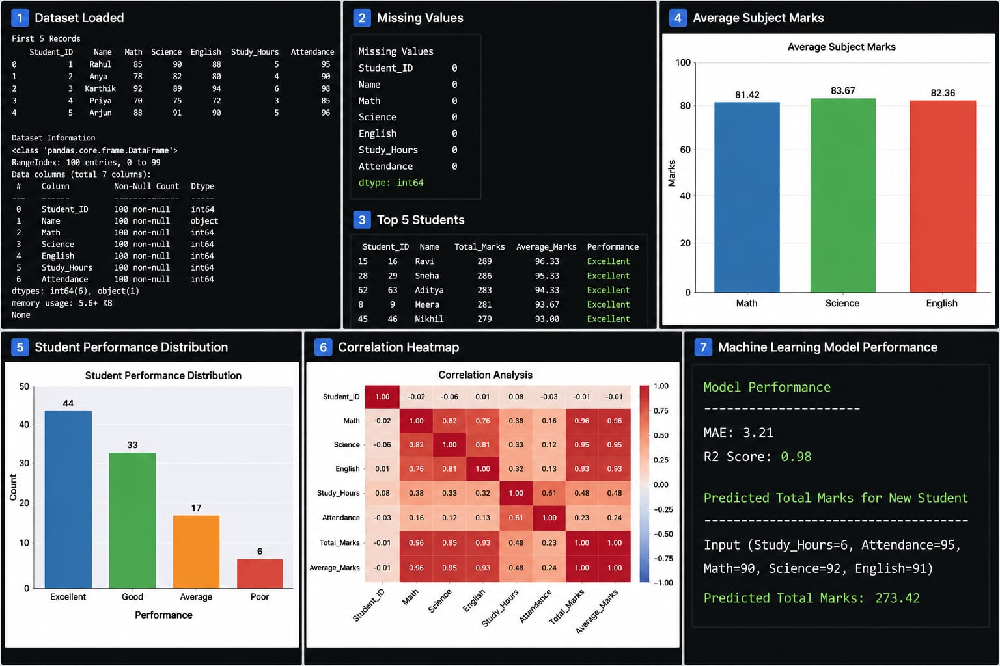

# 📊 Student Performance Analysis & Prediction

A Data Science project developed using **Python, Pandas, Matplotlib, Seaborn, and Scikit-learn** to analyze student performance, visualize insights, and predict total marks using Machine Learning.

---

## 📌 Project Overview

This project analyzes student academic performance based on study hours, attendance, and subject marks. It performs Exploratory Data Analysis (EDA), visualizes key insights, classifies student performance, and builds a Linear Regression model to predict total marks.

---

## 📊 Project Output



---

## ✨ Features

- 📂 Load and explore the dataset
- 🧹 Check for missing values
- 📊 Calculate Total Marks & Average Marks
- 🏆 Classify student performance
- 📈 Display Top 5 Students
- 📊 Average Subject Marks Visualization
- 📉 Performance Distribution
- 🔥 Correlation Heatmap
- 🤖 Linear Regression Model
- 🎯 Predict Total Marks for a New Student

---

## 🛠️ Technologies Used

- Python
- Pandas
- NumPy
- Matplotlib
- Seaborn
- Scikit-learn

---

## 📂 Dataset

The dataset contains:

- Student Name
- Math Marks
- Science Marks
- English Marks
- Study Hours
- Attendance

---

## 📈 Machine Learning

**Algorithm Used**

- Linear Regression

**Evaluation Metrics**

- Mean Absolute Error (MAE)
- R² Score

---

## 📁 Project Structure

```
Student-Performance-Analysis/
│── README.md
│── student_analysis.py
│── Student_performance.csv
│── requirements.txt
└── images/
    └── output.png
```

---

## ▶️ How to Run

1. Clone the repository

```bash
git clone https://github.com/yourusername/Student-Performance-Analysis.git
```

2. Install dependencies

```bash
pip install -r requirements.txt
```

3. Run the project

```bash
python student_analysis.py
```

---

## 📷 Visualizations

- Average Subject Marks
- Student Performance Distribution
- Correlation Heatmap

---

## 🚀 Future Improvements

- Add more student features
- Try advanced Machine Learning algorithms
- Build an interactive dashboard using Streamlit
- Deploy as a web application

---

## 👩‍💻 Author

**Kuchimanchi Lakshmi Saranya**

🎓 Data Science Student

🔗 GitHub: https://github.com/saranyakuchimanchi5-dot

🔗 LinkedIn: https://www.linkedin.com/in/lakshmi-saranya-kuchimanchi-6116b5341

---

⭐ If you found this project useful, consider giving it a **Star** on GitHub!
⭐ Feedback and suggestions are welcome!
